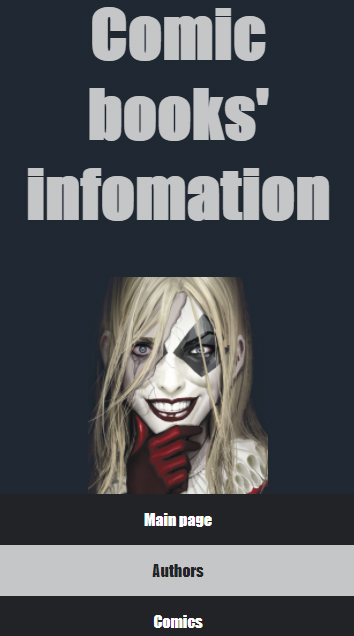

# ComicWeb
Created with Node.js, EJS templates, framework Express and framework ORM - sequelize library, Docker.


## Table of contents
* [General info](#general-info)
* [Technologies](#technologies)
* [Setup](#setup)
* [Preview](#preview)

## General info
This is a website that shows informations about comics and: 
* shows comics, authors and authorship data,
* let users loged in and loged out,
* safe way to keep password in database as hash (bcryptjs),
* let logged user add, edit and delete data about comics, authors, authorship,
* keep away pages from not logged in users
* client-side and server-side validate form ( add form | edit form),
* communication with database via sequelize library
* two-languages mechanism - polish and english (i18n)

## Technologies
Project is created with:
* Node.js v14.15.4
* Docker v20.10.2
* npm v6.14.10
* [IDE] Visual Studio Code 1.53.2


## Setup
To run this project, install it locally using npm:
```
$ cd ../ComicWeb
$ npm i
```
To run the project:
```
$ npm start
```
To run the database server (go to file docker-compose.yml):
```
$ cd ../ComicWeb/docker
$ docker-compose up
```
Install other libraries:
```
$ npm i -g nodemon        
$ npm i sequelize
$ npm i express-session
$ npm i bcryptjs
$ npm i i18n
```

## Preview
### Full:
<p align="center">

</p>

### Change languages:
<p align="center">

</p>

### Validation:
<p align="center">

</p>

### Media looks:
<p align="center">


<p>

